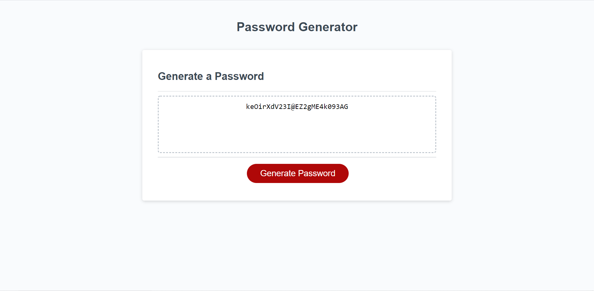

# password-generator

This is an application I created to generate a random password based on the criteria selected.  You will be prompted for the criteria as follows: 
 1. The password needs to be a length of 8 and 128 characters.
 2. You will be able to select from four different character type:
    - lower case
    - upper case
    - numbers
    - special characters
 3. You can select between one and four character types, but you ***must*** select at least one of them.
 
 Link to the [password generator](https://jburz.github.io/password-generator)

 
 
 ## Credits
 
 I used two external sources:
 * A function from MDN to generate a random integer between two variables that is inclusive.
 [Mozilla Page](https://developer.mozilla.org/en-US/docs/Web/JavaScript/Reference/Global_Objects/Math/random)

 * A function to shuffle the final password string into a random order.
 [Shuffle](https://www.codegrepper.com/code-examples/javascript/JAVASCRIPT+shuffle+a+string)

 The rest of the application was created by [Jake Burzlaff](https://www.github.io/jburz).